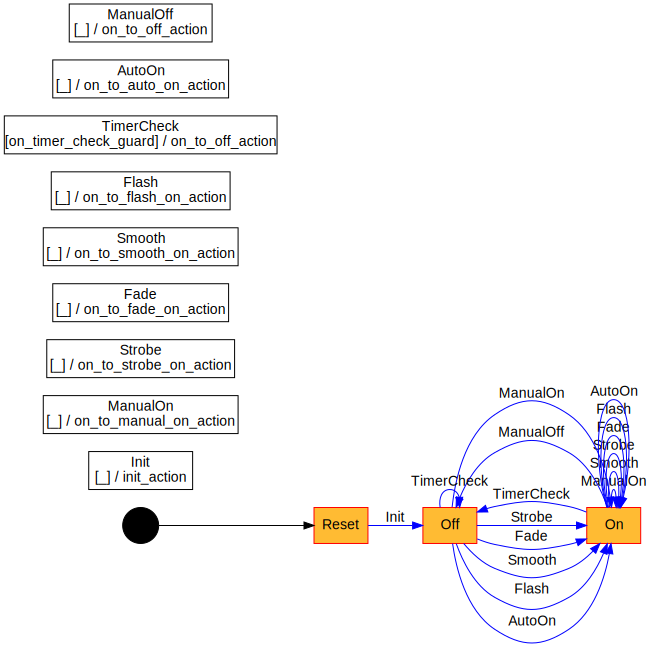

# night-light

The controller runs a little state machine, generated vi [smlang](https://crates.io/crates/smlang).


## IR Receiver

Protocol: NEC variant with 16 bit address and NEC standard timing

## Build the Firmware

```bash
cargo build
```

## Flash the Firmware

Dependencies:

* [st-link](https://github.com/texane/stlink) : `sudo apt-get install stlink-tools`
* [OpenOCD](http://openocd.org/getting-openocd/) : `sudo apt-get install openocd`

NOTE: the two jumpers on `boot0` and `boot1` select RAM or FLASH.

* Both tied to `0` == Flash
* Both tied to `1` == System memory

Tie both jumpers to `0`.

**WARNING**: make sure the USB micro cable is disconnected while powering
the board with the st-link programmer!

If you are powering the board via the USB connection, then don't connect the
st-link's 3.3V pin.

Connect USB st-link to the the Black Pill board:

| st-link | Black Pill |
| :---    |       ---: |
| PIN 2 SWDIO  | DIO |
| PIN 4 GND    | GND |
| PIN 6 SWCLK  | SCK |
| PIN 8 3.3V   | 3V3 |

Plug in the st-link to the host, this will power up the Black Pill board.

Build and flash the firmware:

```bash
# Release build then upload
./flash-firmware
```

To flash a pre-built ELF binary:

```bash
openocd -f openocd.cfg -c "program /path/to/binary verify reset"
```

### Debug/stdout

The debug serial port is connected to USART1, PB6 Tx, PB7 Rx.

```bash
stty -F /dev/ttyUSB0 115200
cat /dev/ttyUSB0
```

```bash
openocd -f openocd.cfg
```

```bash
cargo run
```

## Build/Run the Tests

```bash
# cargo test --target x86_64-unknown-linux-gnu --lib
./run-tests
```

## Hardware

* Board: [STM32 Black Pill Development Board](https://robotdyn.com/stm32f303cct6-256-kb-flash-stm32-arm-cortexr-m4-mini-system-dev-board-3326a9dd-3c19-11e9-910a-901b0ebb3621.html)
  - Refman: [STM32F303CCT6](https://www.st.com/content/ccc/resource/technical/document/reference_manual/4a/19/6e/18/9d/92/43/32/DM00043574.pdf/files/DM00043574.pdf/jcr:content/translations/en.DM00043574.pdf)
  - Datasheet: [STM32F303xC](https://www.st.com/resource/en/datasheet/stm32f303cb.pdf)
  - Pinout: [link](https://robotdyn.com/pub/media/GR-00000345==STM32F303CCT6-256KB-STM32MiniSystem/DOCS/PINOUT==GR-00000345==STM32F303CCT6-256KB-STM32MiniSystem.jpg)
  - Schematic: [link](https://robotdyn.com/pub/media/GR-00000345==STM32F303CCT6-256KB-STM32MiniSystem/DOCS/Schematic==GR-00000345==STM32F303CCT6-256KB-STM32MiniSystem.pdf)
* [PowerBoost 500 Basic](https://www.adafruit.com/product/1903)
* [Medium Vibration Sensor Switch](https://www.adafruit.com/product/2384)
* [NeoPixel Ring - 12 x 5050 RGBW LEDs (warm white)](https://www.adafruit.com/product/2851)

### Pins

| Black Pill GPIO | Description |
| :---       |     ---: |
| PA15       | IR input |
| PA12       | Button input |
| PA11       | Vibration sensor input |
| PB3        | SPI1 SCK (NC) |
| PB4        | SPI1 MISO (NC) |
| PB5        | Pixel data output SPI1 MOSI |
| PB6        | Logger USART1 Tx |
| PB7        | Logger USART1 Rx |
| PC13       | On-board LED |

## Links

* [stm32f3xx-hal docs](https://docs.rs/stm32f3xx-hal/0.6.1/stm32f3xx_hal/)
* [embedded-hal docs](https://docs.rs/embedded-hal/0.2.4/embedded_hal/)
